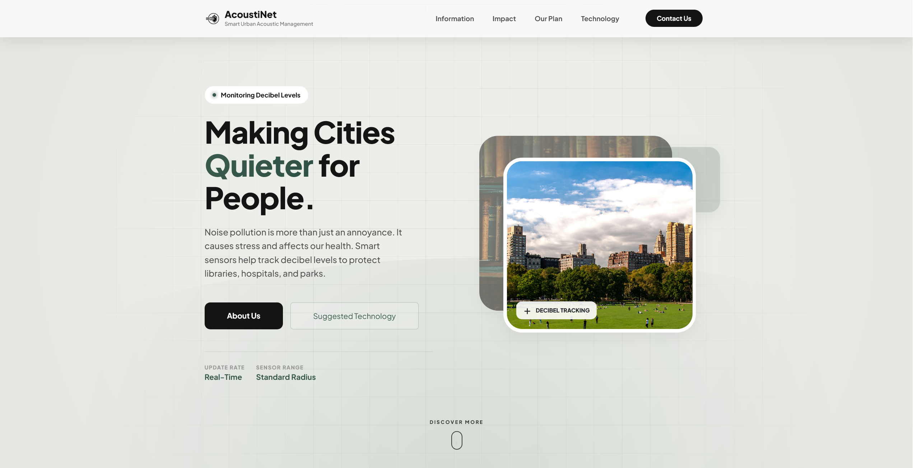

# AcoustiNet
Y8 PBL Project (reupload, original repo at: https://github.com/aliki132/ICT-Y8-Sangria on my old account)

> *Smart Urban Acoustic Management*

**PBL Project (Project-Based-Learning) | Year 8 | Group 2**

A multi-page website exploring urban noise pollution, its impact on human health, wildlife, and infrastructure, and proposing smart acoustic management solutions.

## 📖 Overview

AcoustiNet is an educational website designed to raise awareness about urban noise pollution. The project explores how excessive noise affects human health, wildlife, infrastructure, and proposes practical solutions like sensor-based monitoring and quiet zone implementation.

## 🛠️ Skills Used

| Technology | Purpose |
|------------|---------|
| HTML5 | Structure |
| Bootstrap 5 | Layout & components |
| CSS3 | Styling, animations, transitions |

Team Members: Zay Lin Khant, Zin Win Htun, Min Khant Sithu
